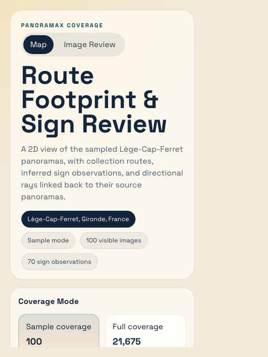

# Panoramax Sign Detection Display

POC for downloading Panoramax street-level imagery, running French road-sign detection and classification, and reviewing the results in a lightweight map UI.

## Live App

https://panoramax-sign-detection-display.julienigou33.workers.dev/

## Screenshot



## What It Does

- downloads Panoramax 360 street-level imagery for a target area
- derives horizontal cube faces from panoramas for model inference
- runs sign detection and sign classification on those derived views
- builds a map interface to inspect route coverage, sign observations, and directional rays
- provides an image-review page to browse source images, crops, predictions, and metadata

## Current POC Stack

- imagery source: Panoramax
- detector: `Panoramax/detect_face_plate_sign`
- classifier: `Panoramax/classify_fr_road_signs`
- frontend: React, Vite, MapLibre
- deployment: Cloudflare Pages

## Repository Layout

- `coverage-map/`: deployed React app
- `scripts/`: download, preprocessing, inference, and asset-generation scripts
- `PANORAMAX_LEGE_CAP_FERRET_360.md`: notes about the first dataset acquisition
- `SIGN_DETECTION_POC_PLAN.md`: implementation plan for the sign-review workflow

## Run Locally

```bash
cd coverage-map
pnpm install
pnpm dev
```

## Refresh Data And Predictions

```bash
python3 scripts/generate_coverage_map_assets.py
python3 scripts/run_sign_poc_inference.py
python3 scripts/generate_sign_map_assets.py
```

This writes refreshed map assets, sign observations, crop previews, and review data into `coverage-map/public/data/`.

## Deploy

The app is deployed as a static site on Cloudflare Pages.

Recommended Pages settings:

- project root: `coverage-map`
- build command: `pnpm build`
- build output directory: `dist`
- Node.js version: `22`

Detailed notes: [coverage-map/CLOUDFLARE_PAGES.md](coverage-map/CLOUDFLARE_PAGES.md)

## Notes

Large downloaded imagery and intermediate outputs are intentionally excluded from Git. The repository keeps the code, docs, and precomputed frontend assets needed to run the app and reproduce the workflow.
